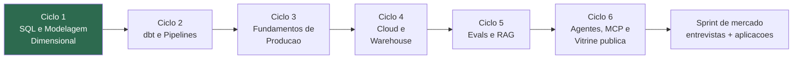

# Plano de estudos — AI/Data Engineer

Trilha de 12 meses para a virada de patamar: **AI/Data Engineer**, mirando
contrato remoto internacional (USD) com o premium BR como chão. Estudo conduzido
por sessões de Claude Code neste repositório (protocolo em `CLAUDE.md`).

## Estado atual

| | |
|---|---|
| **Ciclo em foco** | Ciclo 1 — SQL e Modelagem Dimensional |
| **Unidade atual** | 1.1 — O grão |
| **Início da trilha** | 2026-06-11 |
| **Constante diária** | Inglês 30 min (`roadmap/ingles-trilha-diaria.md`) |

## A trilha

| Ciclo | Tema | Bancada de prática | Janela estimada | Status |
|---|---|---|---|---|
| 1 | SQL e Modelagem Dimensional | Migração EDF | jun-jul 2026 | **EM FOCO** |
| 2 | dbt e Pipelines (ELT) | Migração EDF | jul-ago 2026 | aguardando |
| 3 | Fundamentos de Produção (testes, Docker) | RotaKids + Eurocoding | ago-set 2026 | aguardando |
| 4 | Cloud e Warehouse (BigQuery, Terraform) | Projeto-vitrine (início) | set-out 2026 | aguardando |
| 5 | Evals e RAG | Eurocoding + vitrine | out-dez 2026 | aguardando |
| 6 | Agentes, MCP e vitrine pública | Projeto-vitrine | dez 2026-jan 2027 | aguardando |
| — | Sprint de mercado: entrevistas, aplicações | — | fev-jun 2027 | aguardando |

Trilhas paralelas (não são ciclos — rodam sempre):

- **Inglês (diária, 30 min):** `roadmap/ingles-trilha-diaria.md`
- **Posicionamento (mensal, leve):** `roadmap/missoes-posicionamento.md`

## Regras do jogo

1. **Um ciclo por vez.** Os outros congelam. Trocar de foco é decisão formal, não
   deriva.
2. **Você escreve, a IA revisa.** Exercício resolvido por IA não conta.
3. **Checkbox só fecha com teste.** O professor testa antes de marcar.
4. **Só o ciclo atual é detalhado.** O próximo é escrito no checkpoint do
   anterior — calibrado, não chutado.
5. **Toda sessão termina em commit.** O quadradinho verde é o streak.

## Documentos

- `docs/diagnostico-resultado.md` — o mapa de onde você partiu (2026-06-10).
- `docs/mercado-e-fontes.md` — o que o mercado exige e paga (pesquisa verificada).
- `LOG.md` — registro de todas as sessões.
